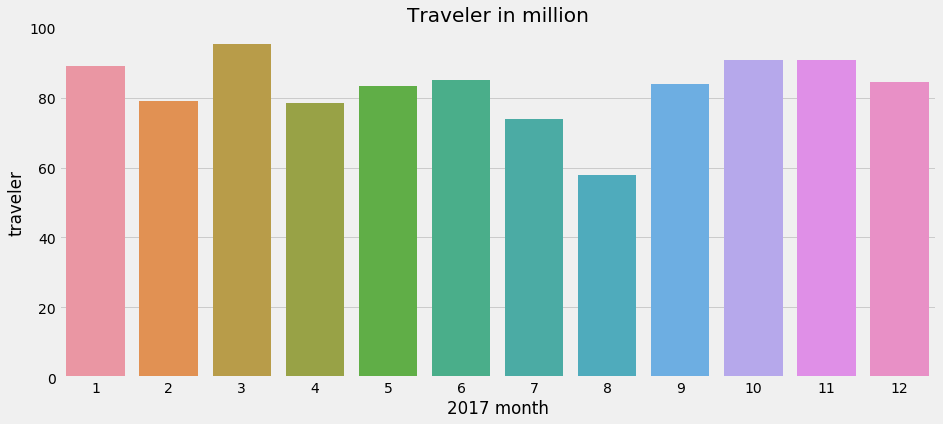
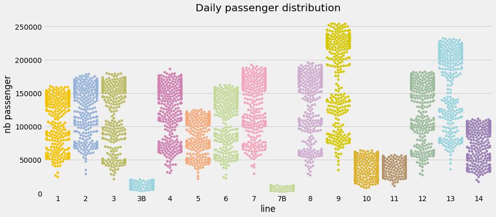
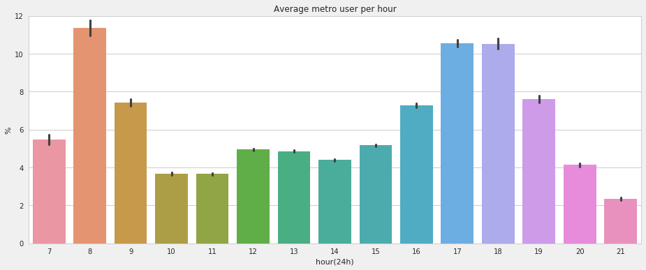
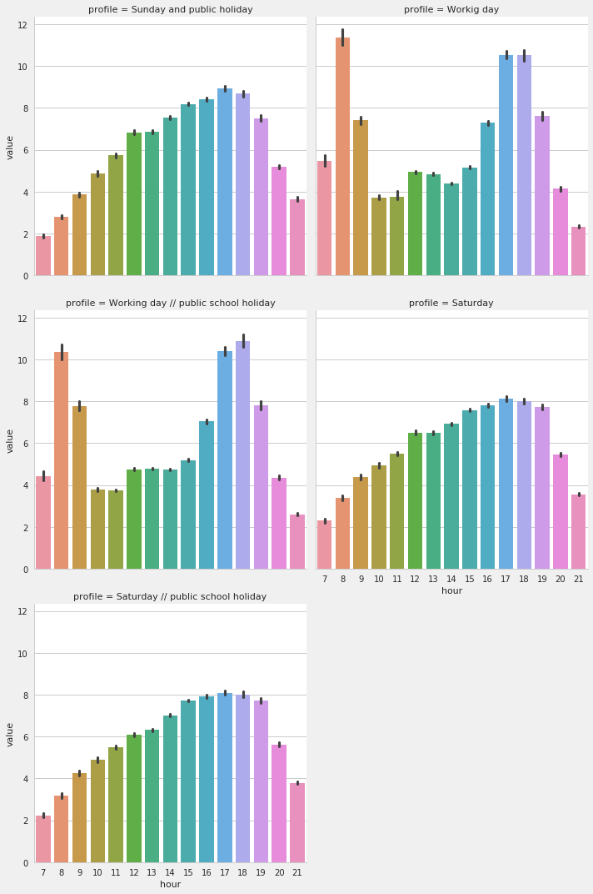

# Parisian metro

In Paris the metro is a daily necessity for most of us.

It has 14 major lines and has around 220 km of railroads. One original fact, compared to other European subway, is that stops are quite close : on average, the inter-distance between 2 stations is 550 m.

Lately I had a discussion and we tried to figure out when you should take it to avoid rush hours.

Common wisdom will say to **avoid** :

* in the morning : between 8 to 9h
* in the evening : between 17 to 19h

Make sense from my experience. However I was wondering : is there any data that can tackle this question ?

## Getting the data

After some googling there is not many data regarding the number of people that get in and out, on a fine grain, of a metro station.

Still, [iledefrance-mobilites](https://www.iledefrance-mobilites.fr/) published lately multiple datasets regarding the number of travelers that gets into a station in 2017.

There are two kinds of datasets that are available, the first one describe the number of daily travelers that validated their ticket at a specific stop.
The other is a hourly ticket validation percentage , built according to some homemade profile, the methodology used does not seem to be explained anywhere.

## Tell me more

Let's get a sense of the number of people that get a ride every month on the metro

There is an expected deep in August when public holidays occur.

An interesting insight is to check how they are distributed across lines

Each point represents the daily number of travelers 

We'll now dive into the second dataset regarding prebuilt profile.

There are 5 profiles defined :

- Working day outside of public school holidays
- Saturdays outside of public school holidays
- Working day during public school holidays
- Saturdays during public school holidays
- Sundays and public holidays(Christmas,...)

The hourly percentage is defined as : the number of daily validation to a specific station divided by the daily validation, therefore percentage on a given day sum-up to 100.

Hereafter an overview

And for each profile

## So ?

Looks like the common wisdom is correct on average. However distribution is not the same for all stop, and it can make sense to go or leave for different hours.

I have set up a power plot [here](https://app.powerbi.com/view?r=eyJrIjoiNDg0NWRhNTYtMGY1Zi00ZjA5LTlhYTctNDQyYjgyMmI3ZTEwIiwidCI6IjkwYzdhMjBhLWYzNGItNDBiZi1iYzQ4LWI5MjUzYjZmNWQyMCIsImMiOjh9) if you want to explore more about it.

